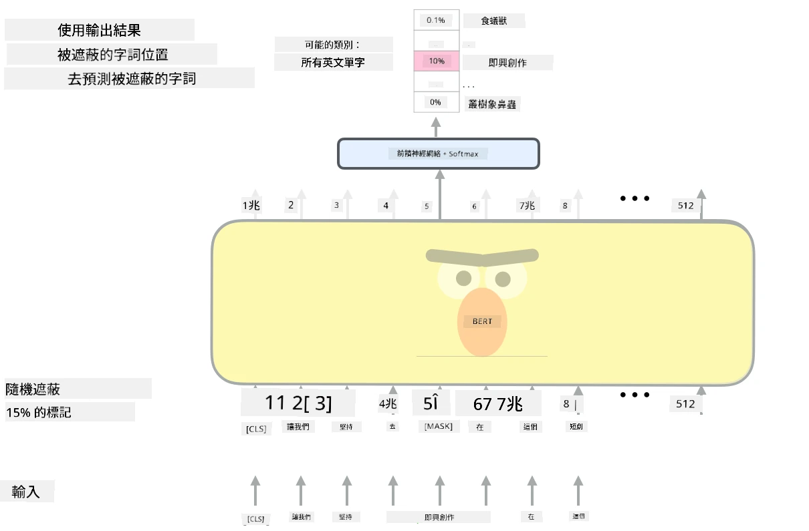

# 注意機制與Transformer

## [課前測驗](https://ff-quizzes.netlify.app/en/ai/quiz/35)

在自然語言處理（NLP）領域中，**機器翻譯**是最重要的問題之一，這是一項支撐像 Google 翻譯等工具的基本任務。在本節中，我們將重點討論機器翻譯，或者更廣泛地說，任何*序列到序列*的任務（也稱為**句子轉換**）。

使用RNN時，序列到序列的實現是通過兩個循環神經網絡完成的，其中一個網絡，即**編碼器**，將輸入序列壓縮成隱藏狀態，而另一個網絡，即**解碼器**，將隱藏狀態展開成翻譯結果。然而，這種方法存在一些問題：

* 編碼器網絡的最終狀態難以記住句子的開頭，導致模型在處理長句子時質量下降。
* 序列中的所有詞對結果的影響相同。然而，實際情況中，輸入序列中的某些詞對輸出序列的影響往往更大。

**注意機制**提供了一種方法，能夠對每個輸入向量對RNN輸出預測的上下文影響進行加權。其實現方式是通過在輸入RNN的中間狀態和輸出RNN之間建立捷徑。在生成輸出符號yt時，我們會考慮所有輸入隱藏狀態hi，並賦予不同的權重係數&alpha;t,i。

> [Bahdanau et al., 2015](https://arxiv.org/pdf/1409.0473.pdf)中的加性注意機制編碼器-解碼器模型，引用自[這篇博客文章](https://lilianweng.github.io/lil-log/2018/06/24/attention-attention.html)

注意矩陣{&alpha;i,j}表示某些輸入詞在生成輸出序列中的某個詞時所起的作用程度。以下是一個這樣的矩陣示例：

> 圖片來自[Bahdanau et al., 2015](https://arxiv.org/pdf/1409.0473.pdf)（圖3）

注意機制是目前或接近目前NLP領域的最先進技術的核心。然而，添加注意機制會大幅增加模型參數的數量，這導致了RNN的擴展問題。RNN擴展的一個關鍵限制是模型的循環特性使得訓練難以批量化和並行化。在RNN中，序列的每個元素都需要按順序處理，這意味著它不能輕易並行化。

> 圖片來自[Google的博客](https://research.googleblog.com/2016/09/a-neural-network-for-machine.html)

注意機制的採用結合了這一限制，促成了如今我們所知的最先進Transformer模型的誕生，例如BERT和Open-GPT3。

## Transformer模型

Transformer的主要理念之一是避免RNN的序列特性，並創建一個在訓練過程中可並行化的模型。這是通過實現以下兩個想法來完成的：

* 位置編碼
* 使用自注意機制來捕捉模式，而不是使用RNN（或CNN）（這也是為什麼介紹Transformer的論文名為*[Attention is all you need](https://arxiv.org/abs/1706.03762)*）

### 位置編碼/嵌入

位置編碼的理念如下：
1. 使用RNN時，標記的相對位置由步數表示，因此不需要顯式表示。
2. 然而，一旦我們切換到注意機制，我們需要知道序列中標記的相對位置。
3. 為了獲得位置編碼，我們將標記序列與序列中的標記位置序列（即數字序列0,1, ...）進行擴充。
4. 然後我們將標記位置與標記嵌入向量混合。為了將位置（整數）轉換為向量，我們可以使用不同的方法：

* 可訓練嵌入，類似於標記嵌入。這是我們在此考慮的方法。我們在標記和它們的位置上應用嵌入層，生成具有相同維度的嵌入向量，然後將它們相加。
* 固定位置編碼函數，如原始論文中所提出。

> 圖片由作者提供

通過位置嵌入，我們得到的結果既嵌入了原始標記，也嵌入了其在序列中的位置。

### 多頭自注意機制

接下來，我們需要捕捉序列中的一些模式。為此，Transformer使用了**自注意機制**，這本質上是將注意機制應用於相同的輸入和輸出序列。應用自注意機制使我們能夠考慮句子中的**上下文**，並查看哪些詞是相互關聯的。例如，它使我們能夠看到哪些詞是由指代詞（如*它*）指代的，並且能夠考慮上下文：

> 圖片來自[Google的博客](https://research.googleblog.com/2017/08/transformer-novel-neural-network.html)

在Transformer中，我們使用**多頭注意機制**，以賦予網絡捕捉多種依賴關係的能力，例如長期與短期詞語關係、指代與其他關係等。

[TensorFlow Notebook](TransformersTF.ipynb)包含有關Transformer層實現的更多細節。

### 編碼器-解碼器注意機制

在Transformer中，注意機制用於兩個地方：

* 捕捉輸入文本中的模式，使用自注意機制。
* 執行序列翻譯——這是編碼器和解碼器之間的注意層。

編碼器-解碼器注意機制與RNN中使用的注意機制非常相似，如本節開頭所述。以下動畫圖解釋了編碼器-解碼器注意機制的作用。

由於每個輸入位置獨立映射到每個輸出位置，Transformer比RNN更能進行並行化，這使得能夠構建更大、更具表達力的語言模型。每個注意頭可以用於學習詞語之間的不同關係，從而改善下游自然語言處理任務。

## BERT

**BERT**（Bidirectional Encoder Representations from Transformers）是一個非常大的多層Transformer網絡，*BERT-base*有12層，*BERT-large*有24層。該模型首先在大規模文本數據（維基百科+書籍）上進行無監督訓練（預測句子中的被遮蔽詞）。在預訓練過程中，模型吸收了大量的語言理解能力，這些能力可以通過微調其他數據集來利用。這個過程稱為**遷移學習**。

> 圖片[來源](http://jalammar.github.io/illustrated-bert/)

## ✍️ 練習：Transformer

在以下筆記本中繼續學習：

* [PyTorch中的Transformer](TransformersPyTorch.ipynb)
* [TensorFlow中的Transformer](TransformersTF.ipynb)

## 結論

在本課中，你學習了Transformer和注意機制，這些都是NLP工具箱中的重要工具。Transformer架構有許多變體，包括BERT、DistilBERT、BigBird、OpenGPT3等，可以進行微調。[HuggingFace套件](https://github.com/huggingface/)提供了使用PyTorch和TensorFlow訓練這些架構的資源庫。

## 🚀 挑戰

## [課後測驗](https://ff-quizzes.netlify.app/en/ai/quiz/36)

## 回顧與自學

* [博客文章](https://mchromiak.github.io/articles/2017/Sep/12/Transformer-Attention-is-all-you-need/)，解釋了Transformer的經典論文[Attention is all you need](https://arxiv.org/abs/1706.03762)。
* [一系列博客文章](https://towardsdatascience.com/transformers-explained-visually-part-1-overview-of-functionality-95a6dd460452)，詳細解釋了Transformer的架構。

## [作業](assignment.md)

---

