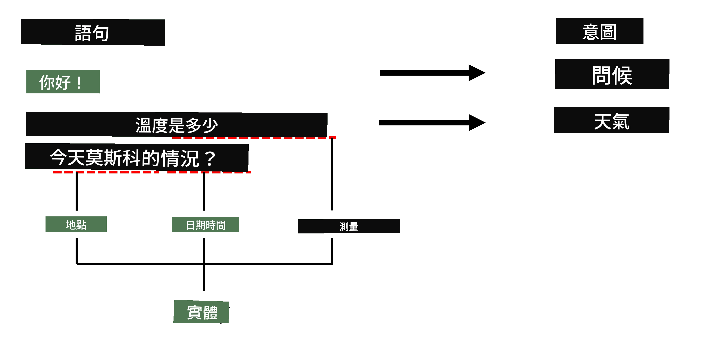

# 命名實體識別

到目前為止，我們主要集中在一個 NLP 任務——分類。然而，還有其他 NLP 任務可以通過神經網絡完成。其中一個任務是 **[命名實體識別](https://wikipedia.org/wiki/Named-entity_recognition)**（NER），它的目的是識別文本中的特定實體，例如地點、人名、日期時間區間、化學式等等。

## [課前測驗](https://ff-quizzes.netlify.app/en/ai/quiz/37)

## 使用 NER 的範例

假設你想開發一個自然語言聊天機器人，類似於 Amazon Alexa 或 Google Assistant。智能聊天機器人的工作方式是通過對輸入句子進行文本分類來*理解*用戶的需求。分類的結果稱為 **意圖**（intent），它決定了聊天機器人應該執行什麼操作。

> 圖片由作者提供

然而，用戶可能會在短語中提供一些參數。例如，當詢問天氣時，她可能會指定地點或日期。機器人應該能夠理解這些實體，並相應地填充參數槽，然後再執行操作。而這正是 NER 發揮作用的地方。

> ✅ 另一個範例是[分析科學醫學論文](https://soshnikov.com/science/analyzing-medical-papers-with-azure-and-text-analytics-for-health/)。我們需要尋找的主要內容之一是特定的醫學術語，例如疾病和醫學物質。雖然少量的疾病可能可以通過子字串搜索提取，但更複雜的實體（如化學化合物和藥物名稱）則需要更複雜的方法。

## NER 作為標記分類

NER 模型本質上是 **標記分類模型**，因為對於每個輸入的標記，我們需要決定它是否屬於某個實體，如果是，則屬於哪個實體類別。

考慮以下論文標題：

**三尖瓣返流** 和 **碳酸鋰** **毒性** 在新生兒中的表現。

這裡的實體是：

* 三尖瓣返流是一種疾病（`DIS`）
* 碳酸鋰是一種化學物質（`CHEM`）
* 毒性也是一種疾病（`DIS`）

注意，一個實體可能包含多個標記。而且，如本例所示，我們需要區分兩個連續的實體。因此，通常為每個實體使用兩個類別——一個指定實體的第一個標記（通常使用 `B-` 前綴，表示 **b**eginning），另一個表示實體的延續部分（`I-`，表示 **i**nner token）。我們還使用 `O` 作為類別來表示所有 **o**ther 標記。這種標記標籤方法稱為 [BIO 標記法](https://en.wikipedia.org/wiki/Inside%E2%80%93outside%E2%80%93beginning_(tagging))（或 IOB）。標記後，我們的標題將如下所示：

標記 | 標籤
------|-----
三尖瓣 | B-DIS
返流 | I-DIS
和 | O
碳酸 | B-CHEM
鋰 | I-CHEM
毒性 | B-DIS
在 | O
新生兒 | O
中 | O
的 | O
表現 | O
。 | O

由於我們需要在標記和類別之間建立一對一的對應關係，我們可以從這張圖中訓練一個右側的 **多對多** 神經網絡模型：

> *圖片來自 [這篇部落格文章](http://karpathy.github.io/2015/05/21/rnn-effectiveness/)，作者為 [Andrej Karpathy](http://karpathy.github.io/)。NER 標記分類模型對應於圖片中最右側的網絡架構。*

## 訓練 NER 模型

由於 NER 模型本質上是一個標記分類模型，我們可以使用我們已經熟悉的 RNN 來完成這項任務。在這種情況下，每個循環網絡的區塊將返回標記 ID。以下範例筆記本展示了如何訓練 LSTM 進行標記分類。

## ✍️ 範例筆記本：NER

繼續學習以下筆記本：

* [使用 TensorFlow 的 NER](NER-TF.ipynb)

## 結論

NER 模型是一種 **標記分類模型**，這意味著它可以用來執行標記分類。這是一個 NLP 中非常常見的任務，有助於識別文本中的特定實體，包括地點、名字、日期等。

## 🚀 挑戰

完成以下連結的作業，訓練一個醫學術語的命名實體識別模型，然後嘗試在不同的數據集上進行測試。

## [課後測驗](https://ff-quizzes.netlify.app/en/ai/quiz/38)

## 複習與自學

閱讀部落格文章 [循環神經網絡的非凡效能](http://karpathy.github.io/2015/05/21/rnn-effectiveness/)，並按照文章中的進一步閱讀部分加深你的知識。

## [作業](lab/README.md)

在本課的作業中，你需要訓練一個醫學實體識別模型。你可以從本課描述的 LSTM 模型訓練開始，然後嘗試使用 BERT 轉換器模型。閱讀 [說明](lab/README.md) 以獲取所有詳細信息。

---

