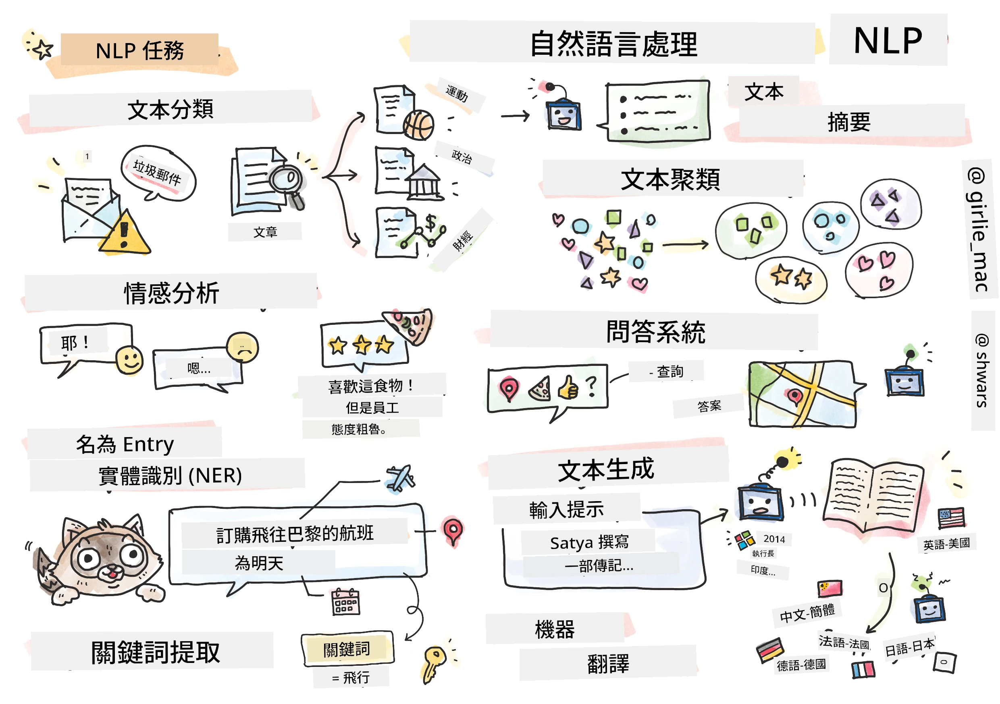

# 自然語言處理



在本節中，我們將專注於使用神經網路處理與<strong>自然語言處理（NLP）</strong>相關的任務。我們希望電腦能夠解決許多 NLP 問題：

* <strong>文本分類</strong> 是一種典型的文本序列分類問題。例子包括將電子郵件訊息分類為垃圾郵件與非垃圾郵件，或將文章分類為體育、商業、政治等。此外，在開發聊天機器人時，我們經常需要理解使用者的意圖——這種情況下我們處理的是<strong>意圖分類</strong>。通常在意圖分類中，我們需要處理許多類別。
<em> <strong>情感分析</strong> 是一種典型的回歸問題，我們需要為句子的正向/負向意義分配一個數字（情感值）。更進階的情感分析是<strong>基於方面的情感分析</strong>（ABSA），我們會將情感分配給句子的不同部分（方面），例如：</em>在這家餐廳，我喜歡料理，但氣氛很糟糕*。
<em> <strong>命名實體識別</strong>（NER）是指從文本中提取特定實體的問題。例如，我們可能需要了解在短語</em>我明天需要飛往巴黎<em>中，單詞</em>明天<em>指的是日期，</em>巴黎*是地點。  
* <strong>關鍵詞提取</strong> 與 NER 類似，但我們需要自動提取對句子意義重要的詞，而不針對特定實體類型進行預訓練。
* <strong>文本聚類</strong> 在我們想將相似的句子分組時非常有用，例如技術支持對話中的相似請求。
* <strong>問答系統</strong> 指模型能夠回答具體問題的能力。模型輸入一段文本和一個問題，並需要提供文本中包含問題答案的位置（或有時生成答案文字）。
<em> <strong>文本生成</strong> 是模型生成新文本的能力。這可以視為根據某些</em>文本提示*預測下一個字母/單詞的分類任務。進階文本生成模型如 GPT-3，能夠使用稱為[提示編程](https://towardsdatascience.com/software-3-0-how-prompting-will-change-the-rules-of-the-game-a982fbfe1e0)或[提示工程](https://medium.com/swlh/openai-gpt-3-and-prompt-engineering-dcdc2c5fcd29)的技術解決其他 NLP 任務，例如分類。
* <strong>文本摘要</strong> 是一種技術，讓電腦「閱讀」長文本並用幾句話進行摘要。
* <strong>機器翻譯</strong> 可以看作是對一種語言的文本理解和另一種語言的文本生成的組合。

最初，大多數 NLP 任務是使用傳統方法如語法結構來解決的。例如，在機器翻譯中，解析器被用於將初始句子轉換為語法樹，然後提取更高層次的語義結構以表示句子意義，基於這個意義和目標語言的語法生成結果。如今，許多 NLP 任務更有效地使用神經網路來解決。

> 許多經典 NLP 方法實現於 Python 庫 [Natural Language Processing Toolkit (NLTK)](https://www.nltk.org) 中。線上有一本很棒的 [NLTK 書籍](https://www.nltk.org/book/) 講解如何使用 NLTK 解決不同的 NLP 任務。

在本課程中，我們將主要專注於使用神經網路進行 NLP，並在需要時使用 NLTK。

我們已經學過使用神經網路處理表格式資料和影像。這些資料型態與文本的主要差異在於文本是變長的序列，而影像的輸入大小事先已知。雖然卷積網路能夠從輸入資料中提取模式，但文本中的模式更複雜。例如，否定詞可能會在主詞與動詞之間與任意多詞分隔（如 <em>我不喜歡橘子</em>，對比 <em>我不喜歡那些又大又彩色又美味的橘子</em>），而這仍應該被視作一個模式。因此，處理語言需要引入新的神經網路類型，如<em>循環網路</em>和<em>變壓器</em>。

## 安裝函式庫

如果您使用本機 Python 安裝來執行本課程，可能需要使用以下指令安裝所有 NLP 所需的函式庫：

**PyTorch 版**
```bash
pip install -r requirements-pytorch.txt
```
**TensorFlow 版**
```bash
pip install -r requirements-tf.txt
```

> 您也可以在 [Microsoft Learn](https://docs.microsoft.com/learn/modules/intro-natural-language-processing-tensorflow/?WT.mc_id=academic-77998-cacaste) 上試用 TensorFlow 的 NLP

## GPU 警告

本節中，有些範例會訓練相當大的模型。
* **使用具 GPU 功能的電腦**：建議在具 GPU 功能的電腦上執行筆記本，以減少使用大型模型時的等待時間。
* **GPU 記憶體限制**：在 GPU 上運行可能會遇到 GPU 記憶體不足的情況，尤其是在訓練大型模型時。
* **GPU 記憶體消耗**：訓練過程中 GPU 記憶體的使用量取決於多種因素，包括小批量大小。
* <strong>最小化小批量大小</strong>：遇到 GPU 記憶體問題時，可以考慮降低程式中的小批量大小。
* **TensorFlow GPU 記憶體釋放**：舊版本的 TensorFlow 可能無法在一個 Python 核心訓練多個模型時正確釋放 GPU 記憶體。為了有效管理 GPU 記憶體使用，您可以設定 TensorFlow 僅在需要時分配 GPU 記憶體。
* <strong>程式碼引入</strong>：要設定 TensorFlow 僅在需要時增加 GPU 記憶體分配，請在筆記本中加入以下程式碼：

```python
physical_devices = tf.config.list_physical_devices('GPU') 
if len(physical_devices)>0:
    tf.config.experimental.set_memory_growth(physical_devices[0], True) 
```

如果您有興趣從經典機器學習視角學習 NLP，請參訪[這套課程](https://github.com/microsoft/ML-For-Beginners/tree/main/6-NLP)

## 本節內容
在本節中，我們將學習：

* [將文本表示為張量](13-TextRep/README.md)
* [詞嵌入](14-Embeddings/README.md)
* [語言模型](15-LanguageModeling/README.md)
* [循環神經網路](16-RNN/README.md)
* [生成式網路](17-GenerativeNetworks/README.md)
* [變壓器](18-Transformers/README.md)

---

<!-- CO-OP TRANSLATOR DISCLAIMER START -->
**免責聲明**：
此文件已使用 AI 翻譯服務 [Co-op Translator](https://github.com/Azure/co-op-translator) 進行翻譯。雖然我們努力追求準確性，但請注意自動翻譯可能包含錯誤或不準確之處。原始文件的母語版本應視為權威來源。對於關鍵資訊，建議採用專業人工翻譯。我們不對因使用此翻譯所產生的任何誤解或誤譯承擔責任。
<!-- CO-OP TRANSLATOR DISCLAIMER END -->