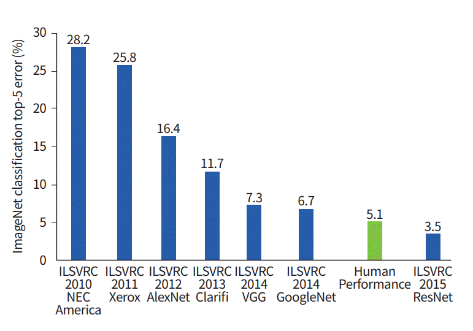

> 图片来自 [Dmitry Soshnikov](http://soshnikov.com)

随着时间的推移，计算资源变得更加便宜，数据也变得更加丰富，因此神经网络方法在许多领域（如计算机视觉或语音理解）与人类竞争时表现出了出色的性能。在过去十年中，人工智能一词主要被用作神经网络的同义词，因为我们听到的大多数人工智能成功案例都是基于它们的。

我们可以观察到方法的变化，例如，在创建一个下棋的计算机程序时：

* 早期的国际象棋程序基于搜索——程序明确尝试估计在给定的下一步中对手可能的走法，并根据可以在几步内实现的最佳位置选择一个最佳走法。这导致了所谓的 [alpha-beta 剪枝](https://en.wikipedia.org/wiki/Alpha%E2%80%93beta_pruning) 搜索算法的发展。
* 搜索策略在游戏结束时表现良好，因为搜索空间受限于少量可能的走法。然而，在游戏开始时，搜索空间巨大，算法可以通过学习人类玩家之间的现有对局来改进。后续实验采用了所谓的 [案例推理](https://en.wikipedia.org/wiki/Case-based_reasoning)，程序在知识库中寻找与当前游戏位置非常相似的案例。
* 现代赢得人类玩家的程序基于神经网络和 [强化学习](https://en.wikipedia.org/wiki/Reinforcement_learning)，这些程序通过与自己对弈并从自身错误中学习来学习下棋——就像人类学习下棋时一样。然而，计算机程序可以在更短的时间内进行更多的对局，从而可以更快地学习。

✅ 进行一些研究，了解其他 AI 玩过的游戏。

同样，我们可以看到创建“对话程序”（可能通过图灵测试）的方式是如何变化的：

* 早期的此类程序如 [Eliza](https://en.wikipedia.org/wiki/ELIZA)，基于非常简单的语法规则和将输入句子重新表述为问题。
* 现代助手，如 Cortana、Siri 或 Google Assistant，都是混合系统，使用神经网络将语音转换为文本并识别我们的意图，然后采用一些推理或显式算法来执行所需的操作。
* 在未来，我们可能期待一个完整的基于神经网络的模型能够独立处理对话。最近的 GPT 和 [Turing-NLG](https://turing.microsoft.com/) 系列神经网络在这方面显示出了巨大的成功。 

> 图片来自 Dmitry Soshnikov，[照片](https://unsplash.com/photos/r8LmVbUKgns)来自 [Marina Abrosimova](https://unsplash.com/@abrosimova_marina_foto)，Unsplash

## 最近的人工智能研究

神经网络研究的巨大增长始于2010年左右，当时大型公共数据集开始变得可用。一个名为 [ImageNet](https://en.wikipedia.org/wiki/ImageNet) 的庞大图像集合，包含约1400万张注释图像，催生了 [ImageNet 大规模视觉识别挑战赛](https://image-net.org/challenges/LSVRC/)。

> 图片来自 [Dmitry Soshnikov](http://soshnikov.com)
在2012年，[卷积神经网络](../4-ComputerVision/07-ConvNets/README.md)首次被应用于图像分类，这导致分类错误率显著下降（从近30%降至16.4%）。在2015年，微软研究院的ResNet架构[达到了人类水平的准确率](https://doi.org/10.1109/ICCV.2015.123)。

自那时以来，神经网络在许多任务中表现出了非常成功的行为：

---

年份 | 达到人类水平
-----|--------
2015 | [图像分类](https://doi.org/10.1109/ICCV.2015.123)
2016 | [对话语音识别](https://arxiv.org/abs/1610.05256)
2018 | [自动机器翻译](https://arxiv.org/abs/1803.05567)（中文到英文）
2020 | [图像描述生成](https://arxiv.org/abs/2009.13682)

在过去几年中，我们见证了大型语言模型的巨大成功，例如BERT和GPT-3。这主要得益于大量可用的通用文本数据，使我们能够训练模型以捕捉文本的结构和含义，在通用文本集合上进行预训练，然后将这些模型专门化以处理更具体的任务。在本课程的后续部分，我们将进一步了解[自然语言处理](../5-NLP/README.md)。

## 🚀 挑战

浏览互联网，确定您认为人工智能最有效使用的地方。是地图应用程序，还是某种语音转文本服务，或是视频游戏？研究该系统是如何构建的。

## [课后测验](https://red-field-0a6ddfd03.1.azurestaticapps.net/quiz/201)

## 复习与自学

通过阅读[这节课](https://github.com/microsoft/ML-For-Beginners/tree/main/1-Introduction/2-history-of-ML)，回顾人工智能和机器学习的历史。从该课或本课顶部的速写笔记中选择一个元素，深入研究以理解其演变的文化背景。

**作业**: [游戏创作马拉松](assignment.md)

**免责声明**：  
本文件使用基于机器的人工智能翻译服务进行翻译。尽管我们努力确保准确性，但请注意，自动翻译可能包含错误或不准确之处。原始文件的母语版本应视为权威来源。对于关键信息，建议进行专业人工翻译。我们不对因使用本翻译而产生的任何误解或误释承担责任。