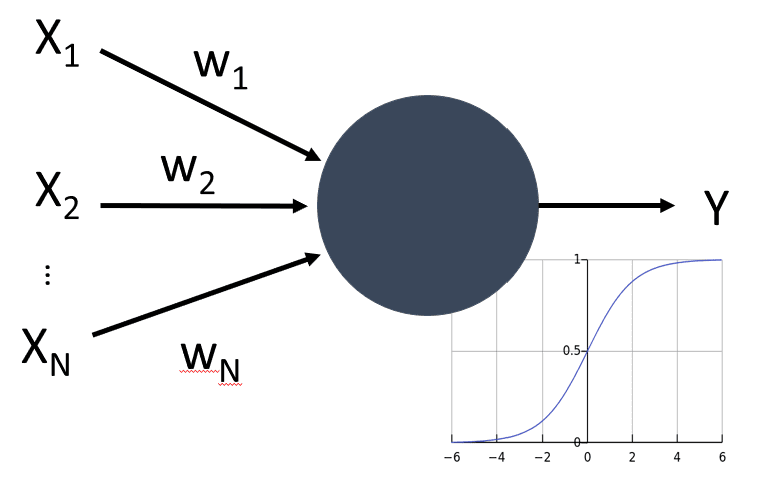

# 神经网络简介

正如我们在介绍中讨论的那样，实现智能的一种方法是训练一个**计算机模型**或**人工大脑**。自20世纪中叶以来，研究人员尝试了不同的数学模型，直到近年来这一方向被证明极为成功。这种对大脑的数学模型被称为**神经网络**。

> 有时神经网络被称为*人工神经网络*，即ANN，以表明我们所讨论的是模型，而不是真实的神经元网络。

## 机器学习

神经网络是一个更大领域的组成部分，称为**机器学习**，其目标是利用数据训练能够解决问题的计算机模型。机器学习构成了人工智能的重要部分，但在本课程中我们不涉及经典的机器学习。

> 请访问我们的**[初学者机器学习](http://github.com/microsoft/ml-for-beginners)**课程，了解更多关于经典机器学习的信息。

在机器学习中，我们假设有一些示例数据集**X**，以及对应的输出值**Y**。示例通常是由**特征**组成的N维向量，而输出称为**标签**。

我们将考虑两种最常见的机器学习问题：

* **分类**，在这里我们需要将输入对象分类到两个或多个类别中。
* **回归**，在这里我们需要为每个输入样本预测一个数值。

> 当将输入和输出表示为张量时，输入数据集是一个大小为M×N的矩阵，其中M是样本数量，N是特征数量。输出标签Y是大小为M的向量。

在本课程中，我们将只关注神经网络模型。

## 神经元模型

从生物学上我们知道，我们的大脑由神经细胞组成，每个神经元有多个“输入”（轴突）和一个输出（树突）。轴突和树突可以传导电信号，轴突和树突之间的连接可以表现出不同程度的导电性（由神经介质控制）。

 | 
----|----
真实神经元 *([图片](https://en.wikipedia.org/wiki/Synapse#/media/File:SynapseSchematic_lines.svg)来自维基百科)* | 人工神经元 *(作者提供的图片)*

因此，神经元的最简单数学模型包含多个输入X1, ..., XN和一个输出Y，以及一系列权重W1, ..., WN。输出的计算公式为：

其中f是某种非线性**激活函数**。

> 神经元的早期模型在1943年由Warren McCullock和Walter Pitts在经典论文[A logical calculus of the ideas immanent in nervous activity](https://www.cs.cmu.edu/~./epxing/Class/10715/reading/McCulloch.and.Pitts.pdf)中描述。Donald Hebb在他的书"[The Organization of Behavior: A Neuropsychological Theory](https://books.google.com/books?id=VNetYrB8EBoC)"中提出了训练这些网络的方法。

## 本节内容

在本节中，我们将学习：
* [感知器](03-Perceptron/README.md)，最早的用于两类分类的神经网络模型之一
* [多层网络](04-OwnFramework/README.md)，配套笔记本[如何构建我们自己的框架](../../../../lessons/3-NeuralNetworks/04-OwnFramework/OwnFramework.ipynb)
* [神经网络框架](05-Frameworks/README.md)，包括这些笔记本：[PyTorch](../../../../lessons/3-NeuralNetworks/05-Frameworks/IntroPyTorch.ipynb)和[Keras/Tensorflow](../../../../lessons/3-NeuralNetworks/05-Frameworks/IntroKerasTF.ipynb)
* [过拟合](../../../../lessons/3-NeuralNetworks/05-Frameworks)

**免责声明**：  
本文件使用基于机器的人工智能翻译服务进行翻译。尽管我们努力追求准确性，但请注意，自动翻译可能包含错误或不准确之处。原始文件的母语版本应被视为权威来源。对于关键信息，建议进行专业人工翻译。我们对因使用本翻译而导致的任何误解或误读不承担责任。